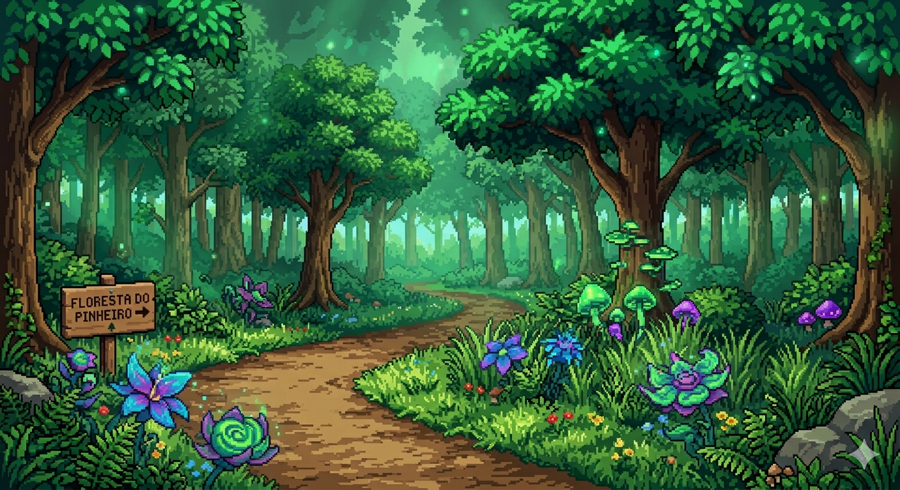

# PokéRush Run



## 1. Identificação do Projeto

- **Título:** PokéRush Run
- **Desenvolvedor:** Paulo Otávio
- **Professor Orientador (Product Owner):** Professor Carlos

---

## 2. Visão Geral do Sistema

### Descrição
O jogo desenvolvido consiste em uma experiência 2D em tempo real, inspirada em elementos visuais do universo Pokémon, com foco em mecânicas de desvio e captura de itens. O jogador controla um personagem posicionado no lado esquerdo da tela, podendo se movimentar verticalmente (para cima e para baixo) com o objetivo de evitar obstáculos e capturar Pokémons pelo caminho.

Durante a execução do jogo, diversos objetos são gerados dinamicamente no lado direito da tela e se deslocam em direção ao personagem. Esses objetos são classificados em dois tipos principais: obstáculos e itens coletáveis. Os obstáculos, representados por pedras, causam a perda de uma vida ao colidir com o jogador. Já os itens coletáveis são Pokémons — Pikachu, Greninja e Rayquaza — que ao serem capturados somam pontos e recuperam uma vida do jogador.

### Objetivo
Sobreviver às 3 fases do jogo desviando de pedras e capturando Pokémons, acumulando pontos e mantendo ao menos 1 vida até o final.

### Tema
Jogo de corrida 2D com tema Pokémon. O jogador controla o Ash atravessando três cenários diferentes — floresta, frente da caverna e interior da caverna — enfrentando desafios crescentes a cada fase.

---

## 3. Instruções de Jogabilidade

### Controles
| Tecla | Ação |
|-------|------|
| W ou ↑ | Mover para cima |
| S ou ↓ | Mover para baixo |

### Coletáveis
| Item | Efeito |
|------|--------|
| Pikachu | +10 pontos e +1 vida |
| Greninja | +10 pontos e +1 vida |
| Rayquaza | +10 pontos e +1 vida |

### Obstáculos
| Item | Efeito |
|------|--------|
| Pedra | -1 vida |

---

## 4. Especificações Técnicas

### Vidas
- O jogador inicia com **5 vidas**
- Colidir com pedras perde **1 vida**
- Capturar Pokémons recupera **1 vida** (máximo 5)
- Zerar as vidas leva à tela de derrota

### Pontuação
- Capturar Pokémon: **+10 pontos**
- Pedra que passa pela tela: **+5 pontos**

### Progressão de Fases
| Fase | Pontos necessários | Velocidade | Cenário |
|------|--------------------|------------|---------|
| Fase 1 | 0 pts | 2 | Floresta |
| Fase 2 | 300 pts | 4 | Frente da caverna |
| Fase 3 | 600 pts | 6 | Interior da caverna |

### Condição de Vitória
Completar a Fase 3 atingindo 1000 pontos com pelo menos 1 vida restante.

---

## 5. Créditos

- **Desenvolvedor:** Paulo Otávio
- **Professor Orientador:** Professor Carlos
- **Disciplina:** Programação Orientada a Objetos
- **Tecnologias:** HTML5, Canvas API, JavaScript ES6+

---

## 6. Instruções de Instalação e Execução

### Clonagem do repositório
```bash
git clone [url-do-repositorio]
```

### Execução
Abra o arquivo `index.html` diretamente no navegador ou utilize uma extensão como **Live Server** no VS Code.

### Link de produção
[Em breve]