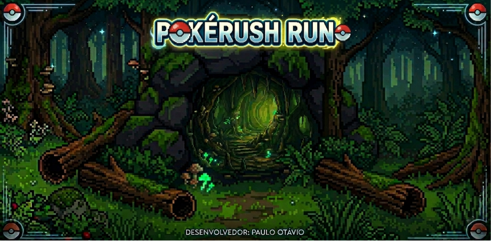

# PokéRush Run



## 1. Identificação do Projeto

- **Título:** PokéRush Run
- **Desenvolvedor:** Paulo Otávio
- **Professor Orientador (Product Owner):** Professor Carlos

---

## 2. Visão Geral do Sistema

### Descrição
O jogo desenvolvido consiste em uma experiência 2D em tempo real, inspirada em elementos visuais do universo Pokémon, com foco em mecânicas de desvio e captura de itens. O jogador controla um personagem posicionado no lado esquerdo da tela, podendo se movimentar verticalmente (para cima e para baixo) com o objetivo de evitar obstáculos e capturar Pokémons pelo caminho.

Durante a execução do jogo, diversos objetos são gerados dinamicamente no lado direito da tela e se deslocam em direção ao personagem. Esses objetos são classificados em dois tipos principais: obstáculos e itens coletáveis. Os obstáculos, representados por pedras, causam a perda de uma vida ao colidir com o jogador. Já os itens coletáveis são Pokémons que evoluem a cada fase — começando por Pichu, Froakie e Charmander, evoluindo para Pikachu, Frogadier e Charmeleon, e finalmente para Raichu, Greninja e Charizard — que ao serem capturados somam pontos e recuperam uma vida do jogador.

### Objetivo
Sobreviver às 3 fases do jogo desviando de pedras e capturando Pokémons, acumulando pontos e mantendo ao menos 1 vida até o final.

### Tema
Jogo de corrida 2D com tema Pokémon. O jogador controla o Ash atravessando três cenários diferentes como: floresta, frente da caverna e interior da caverna, enfrentando desafios crescentes a cada fase.

---

## 3. Requisitos Funcionais

| ID | Requisito | Descrição |
|----|-----------|-----------|
| RF01 | Movimentação | O sistema permite o controle do jogador nos eixos verticais (cima e baixo) |
| RF02 | Sistema de Vidas | O jogador inicia com 5 vidas. Ao colidir com uma pedra, perde 1 vida |
| RF03 | Pontuação | O jogo possui sistema de pontuação com placar exibido em tempo real |
| RF04 | Coletáveis | Pokémons na pista somam pontos e recuperam vidas ao serem capturados |
| RF05 | Progressão de Fases | O jogo possui 3 fases distintas com transição automática por pontuação |
| RF06 | Interface | O jogo contém Menu Inicial, Tela de Jogo, Manual, Sobre, Vitória e Derrota |
| RF07 | Tela Sobre | Exibe dados do desenvolvedor e do Professor Orientador |
| RF08 | Modo 2 Players | O jogo suporta 2 jogadores simultâneos no mesmo teclado |

---

## 4. Requisitos Não Funcionais

| ID | Requisito | Descrição |
|----|-----------|-----------|
| RNF01 | Tecnologia | O sistema é desenvolvido em JavaScript ES6+, compatível com navegadores modernos sem necessidade de transpilação |
| RNF02 | Portabilidade | O jogo roda diretamente no navegador utilizando HTML5 e Canvas API, sem instalação adicional |
| RNF03 | Usabilidade | A interface é projetada para uso em computadores, com resolução de 1200x700px, garantindo que todos os elementos estejam visíveis e operáveis |
| RNF04 | Desempenho | O jogo mantém taxa de atualização estável utilizando `requestAnimationFrame` para garantir fluidez de 60 FPS |
| RNF05 | Animação | O personagem principal possui sistema de animação por frames, proporcionando uma experiência visual mais rica |
| RNF06 | Áudio | O jogo possui efeitos sonoros e música de fundo com controle de volume e loop automático |

## 5. Regras de Negócio

| ID | Regra | Descrição |
|----|-------|-----------|
| RN01 | Dificuldade Progressiva | A cada fase a velocidade das pedras aumenta (Fase 1: 4, Fase 2: 9, Fase 3: 11) |
| RN02 | Troca de Cenário | Cada fase apresenta um fundo diferente (Floresta, Frente da Caverna, Interior da Caverna) |
| RN03 | Evolução dos Pokémons | Os Pokémons coletáveis evoluem a cada fase junto com a progressão do jogo |
| RN04 | Vitória | O jogador vence ao atingir 1000 pontos na Fase 3 com ao menos 1 vida restante |
| RN05 | Derrota | O jogo encerra e exibe tela de derrota quando todas as vidas são zeradas |
| RN06 | Pontuação por Fase | Pedras que passam valem 10 pts na Fase 1 e 5 pts nas Fases 2 e 3 |
| RN07 | Modo 2 Players | No modo 2 jogadores, o jogo encerra quando qualquer um dos jogadores perder todas as vidas |
| RN08 | Limite de Vidas | O jogador não pode ter mais de 5 vidas mesmo ao capturar Pokémons |

---

## 6. Instruções de Jogabilidade

### Modos de Jogo
| Modo | Descrição |
|------|-----------|
| 1 Player | Jogue sozinho controlando o Ash |
| 2 Players | Jogue com um amigo no mesmo teclado |

### Controles
| Tecla | Jogador | Ação |
|-------|---------|------|
| W | Player 1 | Mover para cima |
| S | Player 1 | Mover para baixo |
| ↑ | Player 2 | Mover para cima |
| ↓ | Player 2 | Mover para baixo |

### Coletáveis por Fase
| Fase | Pokémons | Efeito |
|------|----------|--------|
| Fase 1 | Pichu, Froakie, Charmander | +5 pontos e +1 vida |
| Fase 2 | Pikachu, Frogadier, Charmeleon | +5 pontos e +1 vida |
| Fase 3 | Raichu, Greninja, Charizard | +5 pontos e +1 vida |

### Obstáculos
| Item | Efeito |
|------|--------|
| Pedra | -1 vida |

---

## 7. Especificações Técnicas

### Vidas
- O jogador inicia com **5 vidas**
- Colidir com pedras perde **1 vida**
- Capturar Pokémons recupera **1 vida** (máximo 5)
- Zerar as vidas leva à tela de derrota

### Pontuação
- Capturar Pokémon: **+5 pontos** e **+1 vida** (em todas as fases)
- Pedra que passa pela tela na Fase 1: **+10 pontos**
- Pedra que passa pela tela nas Fases 2 e 3: **+5 pontos**

### Progressão de Fases
| Fase | Pontos necessários | Velocidade | Cenário | Pokémons |
|------|--------------------|------------|---------|----------|
| Fase 1 | 0 pts | 4 | Floresta | Pichu, Froakie, Charmander |
| Fase 2 | 300 pts | 9 | Frente da caverna | Pikachu, Frogadier, Charmeleon |
| Fase 3 | 600 pts | 11 | Interior da caverna | Raichu, Greninja, Charizard |

### Condição de Vitória
Completar a Fase 3 atingindo 1000 pontos com pelo menos 1 vida restante.

---

## 8. Créditos

- **Desenvolvedor:** Paulo Otávio
- **Instagram:** [@__paulo.otv](https://www.instagram.com/__paulo.otv)
- **GitHub:** [otaviok9](https://github.com/otaviok9)
- **Instituição:** Sesi Senai - 2026
- **Curso:** Técnico em Desenvolvimento de Sistemas
- **Professor Orientador:** Professor Carlos
- **Disciplina:** Programação Orientada a Objetos
- **Tecnologias:** HTML5, Canvas API, JavaScript ES6+

---

## 9. Instruções de Instalação e Execução

### Clonagem do repositório
```bash
git clone https://github.com/otaviok9/PokeRush-Run.git
```

### Execução
Abra o arquivo `index.html` diretamente no navegador ou utilize uma extensão como **Live Server** no VS Code.

### Link de produção
[Em breve]